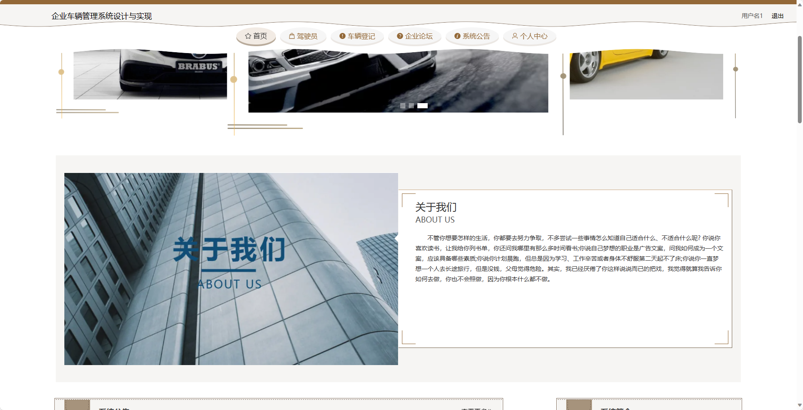

基于SpringBoot的大学生选修选课系统（程序+论文）
=
- 完整代码获取地址：从戎源码网 ([https://armycodes.com/](https://armycodes.com/))
- 作者微信：19941326836  QQ：952045282 
- 承接计算机毕业设计、Java毕业设计、Python毕业设计、深度学习、机器学习
- 选题+开题报告+任务书+程序定制+安装调试+论文+答辩ppt 一条龙服务
- 所有选题地址https://github.com/nature924/allProject

一、项目介绍
---
基于Spring Boot框架实现的企业车辆管理系统，系统包含两种角色：管理员、用户,系统分为前台和后台两大模块

### 前台功能：
1. 首页：展示企业车辆管理系统的概览信息。
2. 驾驶员：提供驾驶员相关的信息。
3. 车辆登记：驾驶员可以进行车辆登记。
4. 企业论坛：提供一个交流平台。
5. 系统公告：管理员发布的系统通知和公告信息。
6. 个人中心：驾驶员或用户可以管理个人信息。

### 后台功能：
### 管理员：
1. 个人中心：管理员可以管理个人信息，包括修改密码等操作。
2. 驾驶员管理：管理员可以对驾驶员信息进行管理，包括查看驾驶员列表、添加、编辑、删除等操作。
3. 用户管理：管理员可以管理系统用户信息，包括查看用户列表、添加、编辑、删除等操作。
4. 车辆登记管理：管理员可以管理车辆登记信息，包括查看登记列表、添加、编辑、删除等操作。
5. 维修信息管理：管理员可以管理车辆维修信息，包括查看维修记录、添加、编辑、删除等操作。
6. 事故信息管理：管理员可以管理车辆事故信息，包括查看事故记录、添加、编辑、删除等操作。
7. 违章信息管理：管理员可以管理车辆违章信息，包括查看违章记录、添加、编辑、删除等操作。
8. 车辆运营管理：管理员可以管理车辆的运营情况，包括查看运营记录、统计分析等操作。
9. 企业论坛：管理员可以管理论坛内容，包括帖子审核、删除等操作。
10. 系统管理：管理员可以管理系统的参数设置、日志查看等功能。

#### 驾驶员：
1. 个人中心：驾驶员可以管理个人信息，包括修改密码等操作。
2. 车辆登记管理：驾驶员可以管理自己的车辆登记信息。
3. 维修信息管理：驾驶员可以查看车辆维修信息，并进行相应的处理。
4. 事故信息管理：驾驶员可以查看车辆事故信息，并进行相应的处理。
5. 违章信息管理：驾驶员可以查看车辆违章信息，并进行相应的处理。
6. 车辆运营管理：驾驶员可以查看车辆运营情况。

二、项目技术
---
- 编程语言：Java
- 数据库：MySQL
- 项目管理工具：Maven
- 前端技术：VUE、HTML、Jquery、Bootstrap
- 后端技术：Spring、SpringMVC、MyBatis

三、运行环境
---
- 操作系统：Windows、macOS都可以
- JDK版本：JDK1.8以上都可以
- 开发工具：IDEA、Ecplise、Myecplise都可以
- 数据库: MySQL5.7以上都可以
- Tomcat：任意版本都可以
- Maven：任意版本都可以

四、运行截图
---
### 论文截图：

### 程序截图：

